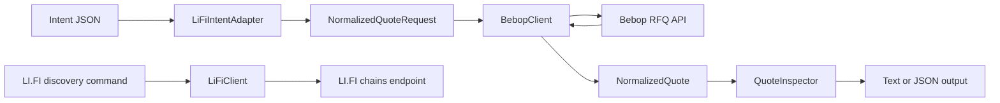

# Intent-to-RFQ Quote Explorer: Development Plan

Date: 2026-10-05

Status: G1-G4 complete and verified on 2026-10-05. G5 local documentation and reproducibility verification are complete on 2026-10-05. The author has supplied the [Demo video on YouTube](https://www.youtube.com/watch?v=BQnzmIagLQ0) and authorized GitHub publication after confirming successful operation in their environment. Code is published on `main` and the first hosted CI run passed; see [submission readiness](docs/submission-readiness.md).

Default implementation: TypeScript CLI on Node.js 24 LTS (24.5+ required for environment proxy support)

This document defines an AI-native implementation workflow organized around five end-to-end goals. Each goal is a milestone and normally produces one substantial, reviewable commit. Completion is recorded explicitly below. Planned goals and commit messages alone are not evidence of working features or successful live quotes.

## 1. Objective and scope

Build a small, read-only tool that accepts a simplified swap intent, normalizes it, requests a Bebop RFQ quote, and explains the returned pricing and transaction information.

The primary user is a developer or reviewer who wants to understand how a user-level exchange request becomes a concrete liquidity-provider quote.

### Required scope

- Accept all seven assignment fields: `fromChain`, `toChain`, `fromToken`, `toToken`, `amountIn`, `userAddress`, and `receiverAddress`.
- Support same-chain quotes on Ethereum and Base.
- Maintain a small, explicit token registry.
- Implement a `LiFiIntentAdapter` and a separate `BebopClient`.
- Display every quote field requested by the assignment.
- Handle invalid input, unsupported routes, upstream failures, and rate limits.
- Deliver setup instructions, an API explanation, a data-flow explanation, limitations, and AI usage notes.
- Provide a GitHub repository and a screenshot or short demo recording at submission time.

### Planned bonuses

- Call the real LI.FI Intents `GET /chains/supported` endpoint.
- Compare quotes for a small number of trade sizes.
- Add deterministic unit and integration tests with mocked HTTP responses.
- Provide a documented one-command startup after dependency installation.
- Explain approval risk and execution assumptions.
- Generate a short, deterministic quote analysis summary.

### Explicit exclusions

- No private keys, wallet signing, token approvals, transaction broadcasting, or settlement.
- No custom smart contract, pool, router, solver, or market-making implementation.
- No cross-chain execution: reject `fromChain !== toChain`.
- No full LI.FI order lifecycle, deposits, signed orders, or refund handling.
- No database, user accounts, background quote polling, or production deployment requirement.
- No requirement to integrate either OKX SDK discussed during research.

The assignment uses a simplified LI.FI-inspired input model. It does not require forwarding that JSON directly to the real LI.FI order server. Calling LI.FI is a separate bonus; Bebop quoting must remain usable independently.

## 2. Research baseline and unresolved dependencies

| Item                         | Current evidence                                                                                                  | Implementation consequence                                        |
| ---------------------------- | ----------------------------------------------------------------------------------------------------------------- | ----------------------------------------------------------------- |
| Local repository             | G1-G4 implementation, tests, examples, demo, CI configuration, discovery/comparison, and documentation complete   | C1-C4 record separate working capabilities                        |
| LI.FI supported chains       | A direct request returned HTTP 200 and included Ethereum and Base                                                 | Use this endpoint for the discovery bonus                         |
| Bebop quote access           | G2 Node client obtained real Ethereum and Base quotes; G1 403 failures remain historical                          | Two-chain live acceptance achieved; record timestamps and expiry  |
| Bebop authentication         | API Reference marks Bearer authorization as required; Quickstart describes restricted unauthenticated demo access | Support optional API-key configuration and verify actual behavior |
| Token coverage               | Registry checked against official lists; USDC-to-WETH real quotes observed on both chains                         | Preserve the small allowlist; current liquidity is not guaranteed |
| Existing project constraints | No applicable `AGENTS.md` found during the directory check                                                        | This plan supplies the initial conventions                        |

Bebop exposes `GET https://api.bebop.xyz/pmm/{network}/v3/quote`. Its documentation should be checked against captured responses during the integration spike. The observed Cloudflare response does not establish whether credentials alone would solve access. See the [quote reference](https://docs.bebop.xyz/rfq-api/api-reference/quote) and [Quickstart authentication guidance](https://docs.bebop.xyz/rfq-api/quickstart).

LI.FI Intents uses `https://order.li.fi`; its integrator endpoints are documented as open. The real quote schema uses a different structure, including interoperable addresses. See the [LI.FI Intents API overview](https://docs.li.fi/lifi-intents/intents-api/api-overview).

### Live-access decision gate

1. Probe one modest same-chain USDC/WETH quote on Ethereum and one on Base.
2. Use a documented public example address or an explicitly supplied public address. A public address is not a signing credential.
3. Record UTC request time, sanitized parameters, HTTP status, content type, and response outcome.
4. Use `BEBOP_API_KEY` when available; never print or commit its value.
5. If access fails, distinguish authentication, edge blocking, rate limiting, unavailable liquidity, and transport failure.
6. Continue independent implementation with clearly labeled fixtures while access is unresolved.
7. Do not mark live integration or submission acceptance complete until successful quotes have been observed on both chains.

A fixture demonstration is useful, but cannot substitute for evidence that the required Bebop integration works.

## 3. Product and technology decisions

### CLI first

A CLI satisfies the assignment and makes exact inputs, machine-readable output, and reproducible demonstrations straightforward. The presentation layer will be thin enough to support a later frontend without changing the adapter or provider client. A frontend is not part of this plan's acceptance criteria.

| Concern              | Proposed choice                      | Reason                                               |
| -------------------- | ------------------------------------ | ---------------------------------------------------- |
| Runtime              | Node.js 24 LTS                       | Supported runtime with built-in HTTP primitives      |
| Language             | TypeScript with strict checking      | Explicit internal and external data contracts        |
| Packaging            | npm and committed lockfile           | Reproducible installation                            |
| CLI parsing          | Commander                            | Small, established command interface                 |
| Runtime validation   | Zod                                  | Validate input and untrusted API responses           |
| EVM utilities        | viem address and unit utilities only | Avoid hand-rolled address handling; no wallet client |
| HTTP                 | Built-in `fetch` with cancellation   | Avoid an unnecessary networking framework            |
| Financial arithmetic | `bigint` and rational calculations   | Preserve token amounts without floating-point loss   |
| Tests                | Vitest                               | Mock HTTP, clocks, and retry timing                  |
| Automation           | GitHub Actions                       | Repeat offline checks on pushes and pull requests    |

Pin compatible dependency versions during scaffolding. Node.js 24 is listed as LTS in the [official release table](https://nodejs.org/en/about/previous-releases). Use the [Vitest guide](https://vitest.dev/guide/) to confirm test-runner compatibility when installing.

### Proposed commands

All five commands below and the offline checks are implemented through G4:

```bash
npm ci
npm start -- normalize --intent examples/ethereum-usdc-weth.json
npm start -- quote --intent examples/ethereum-usdc-weth.json
npm start -- quote --intent examples/base-usdc-weth.json --json
npm start -- compare --intent examples/base-usdc-weth.json --amounts 100,500,1000
npm start -- chains --provider lifi
npm start -- demo
npm run check
```

- `normalize`: validate an intent and display its internal quote request without networking.
- `quote`: live quote inspection from an intent JSON file.
- `compare`: replace `amountIn` with each supplied size and report results separately.
- `chains --provider lifi`: fetch and display the real LI.FI chain catalog.
- `demo`: deterministic offline fixture playback with a visible `MOCK` label.
- `--json`: one JSON result on stdout; diagnostics go to stderr.
- Optional `--raw` remains deferred; current reports omit raw calldata and never include credentials.
- No silent fallback from a failed live request to a successful mock result.

Exit codes: `0` for successful command processing, `2` for invalid input or unsupported routes, and `1` for provider or runtime failures. A structurally valid quote can be displayed with `expired` or `missing_transaction_data` warnings; exit code `0` never asserts execution safety. A comparison containing provider failures returns its partial results and exits with `1`.

## 4. Input contract and normalization

### Input rules

| Field             | Accepted representation         | Rule                                                       |
| ----------------- | ------------------------------- | ---------------------------------------------------------- |
| `fromChain`       | Integer chain ID                | Allow `1` and `8453`                                       |
| `toChain`         | Integer chain ID                | Must equal `fromChain`                                     |
| `fromToken`       | Supported symbol or EVM address | Resolve against the selected chain's registry              |
| `toToken`         | Supported symbol or EVM address | Resolve against the selected chain's registry              |
| `amountIn`        | Human-readable decimal string   | Positive, exact precision, within uint256 after conversion |
| `userAddress`     | EVM address                     | Required, valid, nonzero                                   |
| `receiverAddress` | EVM address                     | Required, valid, nonzero; may differ from user             |

Reject missing fields, unsupported assets, identical sell/buy tokens, numeric JSON amounts, negative/zero values, exponent notation, and excess fractional precision. Do not silently round excess decimals. Normalize casing for comparisons while retaining a consistent display format.

The supported token baseline is WETH and USDC on both chains. Ethereum USDT is an optional small extension after verification. Do not assume that a token symbol identifies the same deployment on every chain. Native ETH is excluded from the initial token list to avoid native-asset special cases.

For example, the external value `"100.25"` USDC becomes the base-unit string `"100250000"`. Keep all provider amounts as strings and internal arithmetic as `bigint`. Never serialize a JavaScript `bigint` directly into JSON.

### Internal quote request

```typescript
interface NormalizedQuoteRequest {
  chainId: 1 | 8453;
  network: 'ethereum' | 'base';
  sellToken: TokenDefinition;
  buyToken: TokenDefinition;
  sellAmountBaseUnits: string;
  takerAddress: string;
  receiverAddress: string;
}
```

`TokenDefinition` includes chain ID, address, symbol, and decimals. Store the provenance of registry entries alongside their configuration or in the integration notes.

`LiFiIntentAdapter` is a pure module: it performs validation and normalization without HTTP, logging, or terminal rendering.

## 5. Architecture and data flow



### Module boundaries

- `config`: chain/token allowlists and environment configuration.
- `domain`: input/output types, validation, amount arithmetic, and structured errors.
- `adapters`: simplified intent to internal request conversion.
- `clients`: HTTP transport, provider parameters, and response validation.
- `services`: quote orchestration and bounded size comparisons.
- `analysis`: price calculations, expiry checks, and deterministic explanations.
- `cli`: commands, text tables, JSON output, and exit-code mapping.

Inject the HTTP function and clock where needed. Inject retry delay behavior into the client for deterministic tests. Do not introduce a plugin framework, dependency-injection container, or generic multi-provider router.

### Proposed repository layout

```text
src/
  cli.ts
  config/{chains,tokens,environment}.ts
  domain/{types,validation,amounts,errors}.ts
  adapters/lifi-intent-adapter.ts
  clients/{http,bebop-client,bebop-schema,lifi-client}.ts
  services/{quote-service,compare-service}.ts
  analysis/quote-inspector.ts
  presentation/{text,json}.ts
tests/
  unit/
  integration/
  fixtures/{bebop,lifi}/
scripts/probe-apis.mjs
examples/
docs/{api-integration,live-verification}.md
docs/demo/
.github/workflows/ci.yml
.env.example
.gitignore
.nvmrc
README.md
AI_USAGE.md
DEVELOPMENT_PLAN.md
package.json
package-lock.json
tsconfig.json
```

Only create a file when its goal needs it; this is an intended layout rather than a requirement for empty scaffolding.

## 6. Bebop integration contract

### Request mapping

| Internal value           | Bebop representation                     |
| ------------------------ | ---------------------------------------- |
| `network`                | URL segment in `/pmm/{network}/v3/quote` |
| `sellToken.address`      | `sell_tokens`                            |
| `buyToken.address`       | `buy_tokens`                             |
| `sellAmountBaseUnits`    | `sell_amounts`                           |
| `takerAddress`           | `taker_address`                          |
| `receiverAddress`        | `receiver_address`                       |
| Standard direct approval | `approval_type=Standard`                 |

Use exact-input requests: do not also send `buy_amounts`. Build query strings with `URLSearchParams`. Add a Bearer header only when a key is configured. Do not copy undocumented parameters from older examples. The mapping follows the [Bebop quote reference](https://docs.bebop.xyz/rfq-api/api-reference/quote).

### Required output and interpretation

| Output                | Source or computation                                                |
| --------------------- | -------------------------------------------------------------------- |
| Sell token and amount | `sellTokens[address]`, formatted with verified decimals              |
| Buy token and amount  | `buyTokens[address]`, formatted with verified decimals               |
| Effective price       | Human-unit buy amount divided by human-unit sell amount; label units |
| Quote expiry          | `expiry`, displayed as UTC time and remaining seconds                |
| Approval target       | `approvalTarget`                                                     |
| Settlement address    | `settlementAddress`                                                  |
| Transaction target    | `tx.to`                                                              |
| Transaction value     | `tx.value`, displayed in base units and native units where useful    |
| Calldata present      | Nonempty, even-length hexadecimal bytes in `tx.data`; `0x` is empty  |

Also display provider, chain, quote ID, retrieval time, warnings, and data provenance (`live` or `mock`). The three contract addresses must remain separate fields. `tx.value` is native currency attached to the call, not the gas fee. See [Bebop settlement architecture](https://docs.bebop.xyz/core-concepts/settlement-smart-contracts).

### Response validation

- Validate HTTP success, JSON parsing, provider error envelopes, and quote schema separately.
- Treat provider JSON as untrusted input; a TypeScript type assertion is insufficient.
- Validate requested chain, token identities, sell amount, taker, and receiver against the response.
- Match token-map keys case-insensitively and verify decimals against the local registry.
- Reject negative, malformed, zero buy amounts, and inconsistent quote data.
- Validate transaction addresses and value when present; check `tx.from` when supplied.
- Allow additional provider fields for forward compatibility.
- Represent a missing or null transaction object explicitly; do not fabricate transaction data or contract addresses.
- Preserve warnings and distinguish a quote from a complete transaction payload.

The inspector must never turn `hasCalldata=true` into a claim that execution has been simulated or guaranteed locally. Balance, allowance, gas sufficiency, bytecode identity, and execution success remain unverified.

### Price arithmetic and expiry

Calculate effective price from integer amounts and token decimals, using a rational representation until display formatting. Define a fixed display precision and rounding policy, and preserve the underlying amounts. The displayed rate includes effects reflected in the quoted amounts but excludes separately paid network fees.

Use the provider's absolute expiry value rather than inventing a fixed quote lifetime. Evaluate expiry with an injected clock at presentation time. Keep retrieval time separate from expiry. Saved quotes are historical observations and must not appear freshly executable when replayed.

## 7. Error and retry policy

G3 implements this policy after the G2 live happy path. The verified `NO_QUOTE` case currently covers Bebop minimum-size rejection; other provider-specific codes are left unclassified until verified. G1 still rejects invalid intents before networking. G2 includes a bounded request timeout, basic HTTP failure reporting, and the response checks needed to avoid displaying an incorrect quote; it does not wait for the full retry and error taxonomy below.

| Error code                  | Trigger                                                  | Behavior                                                        |
| --------------------------- | -------------------------------------------------------- | --------------------------------------------------------------- |
| `INVALID_INPUT`             | Malformed JSON, address, amount, or missing field        | Identify the field; make no API call                            |
| `UNSUPPORTED_ROUTE`         | Unsupported chain/token or cross-chain intent            | Explain supported scope; make no API call                       |
| `NO_QUOTE`                  | Verified provider no-liquidity/no-quote response         | Report no available quote; do not invent output                 |
| `UPSTREAM_AUTH_ERROR`       | Provider authentication rejection                        | Explain credential configuration                                |
| `UPSTREAM_ACCESS_DENIED`    | Edge/WAF denial or other forbidden access                | Distinguish from confirmed API authentication failure           |
| `RATE_LIMITED`              | HTTP 429 or verified provider equivalent                 | Respect bounded retry policy; expose retry guidance             |
| `UPSTREAM_TIMEOUT`          | Request or total deadline exceeded                       | Fail clearly; no unbounded waiting                              |
| `UPSTREAM_FAILURE`          | Transport errors or HTTP 5xx                             | Retry only eligible transient failures                          |
| `INVALID_UPSTREAM_RESPONSE` | HTML success body, invalid JSON/schema, mismatched quote | Explain provider-response failure without dumping unsafe output |

Implemented defaults: 10-second per-attempt timeout, 20-second total request budget, and at most two retries after the first attempt. Retry idempotent quote/discovery GETs only for 429 and selected transient failures. Honor `Retry-After` in seconds or HTTP-date form; if the requested wait exceeds the remaining budget, return guidance instead of retrying early. Otherwise use bounded exponential backoff with jitter.

Do not retry invalid input, authentication failure, edge blocking, response mismatch, or a known no-liquidity result. Keep request headers and keys out of logs. Bound and sanitize any provider message included in terminal output. Test cancellation and clear timers after completion.

## 8. Bonus behavior

### LI.FI discovery

Implement `LiFiClient.getSupportedChains()` against `https://order.li.fi/chains/supported`. Display the provider catalog and highlight the application's supported intersection. Do not confuse LI.FI's record `id` with its actual `chainId`.

This catalog is informational: appearing in LI.FI's list does not prove that Bebop has liquidity for a token pair. LI.FI availability must not become a mandatory dependency of the main quote command.

Defer `/routes` and `POST /quote/request` until the core deliverable is complete. Real LI.FI quote requests need their own protocol-specific adapter; they cannot reuse the simplified JSON unchanged.

### Trade-size comparison

- Accept one to five unique positive decimal sizes; validate all before networking.
- Preserve chain, tokens, taker, and receiver across the comparison.
- Use sequential requests initially, with rate-limit handling and no automatic refresh loop.
- Show each input, output, effective rate, retrieval time, expiry, and failure independently.
- Select the best effective rate only among successful, still-valid observations; keep incomplete transaction payloads labeled.
- Label rate differences as observed size comparisons, not measured market price impact.
- State that sequential requests are not a simultaneous market snapshot and exclude separate gas costs.
- Stop remaining requests on a shared authentication/access failure or exhausted rate limit; report skipped rows explicitly.

### Analysis summary

Generate a short explanation from validated fields, without an LLM dependency. Include the exchange rate, remaining validity, transaction-data completeness, provider warnings, and unverified execution assumptions. Do not recommend executing the trade or claim that a contract is safe solely because its address appeared in an API response.

## 9. Goal-based milestones

The implementation is fully AI-native: work proceeds in substantial end-to-end increments, with runnable behavior and evidence at each checkpoint. Scaffolding, types, client code, presentation, and relevant tests belong together when they serve the same goal. Individual files or architectural layers do not need separate milestones or commits.

**G1-G4 and the revised local G5 scope are complete.** The author-provided [Demo video on YouTube](https://www.youtube.com/watch?v=BQnzmIagLQ0) is linked in the submission notes. Code is published on the remote `main` branch and the first hosted CI run passed. Final delivery status and the latest provider-access limitation are tracked in [submission readiness](docs/submission-readiness.md). CI passed locally and the first hosted Actions run succeeded for commit `a02af85`. The earlier G1 access failure is historical; G2 established a working Node-client path using the existing environment proxy.

G1 acceptance evidence (2026-10-05):

- A clean temporary copy installed successfully with `npm ci` on Node 24.21.0.
- `npm run check` passed formatting, source/test type checking, build, and all **76 tests across 3 files**.
- Both documented example commands ran successfully, with Ethereum text output and Base JSON output.
- Token addresses and decimals were verified against official source lists; see [integration notes](docs/api-integration.md).
- Both G1 quote probes returned HTTP 403. This was the access state at G1 completion; G2 subsequently succeeded on both chains.

| Goal / milestone                              | Observable outcome                                                                             | Main dependency                | Planned commit |
| --------------------------------------------- | ---------------------------------------------------------------------------------------------- | ------------------------------ | -------------- |
| G1: Receive and normalize an intent           | A user can submit an intent file and inspect the exact normalized request                      | None                           | C1             |
| G2: Obtain and inspect a live Bebop quote     | The same input reaches Bebop and produces all required quote fields in the CLI                 | G1                             | C2             |
| G3: Handle failures and establish reliability | Invalid requests and upstream failures produce predictable results, backed by meaningful tests | G2 pipeline                    | C3             |
| G4: Add discovery and quote comparison        | Real LI.FI chain discovery and multiple-size comparisons enrich the explorer                   | G3                             | C4             |
| G5: Package a reproducible submission         | A fresh checkout works and the repository includes documentation and authentic demo evidence   | G1-G4, including live evidence | C5             |

### G1 — Receive and normalize an intent

**User outcome:** provide all seven fields in a JSON file and see exactly what the application will send to a quote provider.

Deliver the project scaffold, CLI input loading, chain/token registry, exact amount utilities, `LiFiIntentAdapter`, Ethereum/Base example files, and focused normalization tests as one working increment. Add `npm start -- normalize --intent <file>` as a small inspection command that remains useful when debugging the later quote flow.

Acceptance criteria:

- A fresh install can run the CLI and normalize both example intents.
- All seven input fields are supported; a distinct receiver is preserved.
- Symbols and addresses resolve on the correct chain, with verified addresses and decimals.
- Human decimal strings convert to exact base-unit strings without rounding or floating-point conversion.
- Unsupported routes and invalid inputs fail before HTTP; key amount and address boundaries have tests.
- The normalized output includes network, token addresses, amounts, taker, and receiver.

Run a minimal read-only Bebop access probe during this goal to expose an external blocker early. It can be a direct request; a reusable probe framework is unnecessary. Record the outcome, but do not make successful provider access a prerequisite for completing the independent intent-input goal.

### G2 — Obtain and inspect a live Bebop quote

**Completed on 2026-10-05.** `npm run check` passed formatting, type checking, build, and **133 tests across 8 files**. Real quotes succeeded on Ethereum and Base, and the final npm startup command produced a further live Base report. See [live verification](docs/live-verification.md). Optional API-key header handling is tested with a fake key; authenticated live access was not exercised.

**User outcome:** run `quote --intent <file>` and inspect an actual Bebop response from the supplied intent.

Implement the entire happy path together: `BebopClient`, optional API-key configuration, exact-input query mapping, response normalization, quote inspection, and text/JSON CLI output. Include a short deterministic analysis summary and enough integration notes to reproduce the request. Prefer a working real request early in this goal, then complete the display around the observed response.

Acceptance criteria:

- Successful real quote requests have been observed on Ethereum and Base, with dated, sanitized evidence.
- Every assignment field is displayed: sell/buy tokens and amounts, effective price and units, expiry, approval target, settlement address, transaction target/value, and calldata presence.
- The requested chain, tokens, amount, taker, and receiver are checked against the returned quote.
- Amounts remain exact; expiry comes from the provider; absent transaction data is explicit.
- HTTP failures terminate clearly, requests have a bounded timeout, and credentials stay out of output.
- Focused request-mapping, response-parsing, and price-calculation checks pass; these do not require a full failure matrix yet.
- The command never signs, approves, broadcasts, or substitutes a mock response for a failed live request.

Defer comprehensive error classification, automatic retries, extensive malformed-response cases, and polished failure UX to G3. The priority is establishing the real intent-to-RFQ path before expanding infrastructure.

If access is blocked, retain the implemented pipeline and record the exact failure. Fixture-based development and G3-G5 preparation may continue, but G2 remains incomplete until both chains have real quote evidence. A commit can preserve useful partial work; it must not be presented as proof that the milestone passed.

### G3 — Handle failures and establish reliability

**Completed on 2026-10-05.** A clean copy passed installation, formatting, type checking, build, and **183 tests across 11 files**. Help, guarded offline JSON demo, and `npm run demo` passed. CI YAML was validated and the equivalent commands ran locally; hosted CI is pending publication. One live Base regression quote succeeded through the new HTTP layer. See [reliability notes](docs/reliability.md).

**User outcome:** understand why a quote failed and trust the tool to handle common failures without hanging or misrepresenting results.

Complete the error policy in Section 7, bounded retries and cancellation, defensive response validation, CLI exit behavior, and explicit offline demo. Consolidate meaningful mocked tests across the adapter, client, inspector, and CLI. Add the offline CI workflow and `npm run check` in this goal so later work inherits those checks.

Acceptance criteria:

- Invalid input, unsupported routes, API failures, and rate limits have clear and consistent text/JSON results.
- Authentication rejection is distinguished from an observed edge/WAF denial; HTML is not treated as a valid quote.
- Retry count, total duration, and `Retry-After` handling are bounded and tested without real waiting.
- Malformed or inconsistent responses, expired quotes, and missing transaction data are covered.
- CLI stdout/stderr and exit codes follow the documented contract.
- `demo` works without network or credentials and clearly labels its output as `MOCK`.
- Offline checks pass locally and CI is configured to run them without provider credentials.

### G4 — Add discovery and quote comparison

**Completed on 2026-10-05.** Formatting, type checking, build, and **244 tests across 14 files** passed on Node 24.21.0. The final discovery CLI returned 30 LI.FI catalog records with Ethereum/Base identified by `chainId`. A live Base comparison of 100, 500, and 1000 USDC returned three validated quotes, all unexpired at collection completion, with calldata present. See [G4 behavior and evidence](docs/discovery-and-comparison.md).

**User outcome:** inspect LI.FI's supported chains and compare Bebop quotes for several trade sizes.

Deliver `LiFiClient`, `chains --provider lifi`, and bounded sequential `compare` requests with per-row results, timestamps, expiry, and analysis. Include the tests needed for catalog interpretation, partial failures, changing quote validity, and request limits.

Acceptance criteria:

- A real LI.FI `/chains/supported` call succeeds; `chainId` is interpreted independently of the record `id`.
- LI.FI discovery is independent of the main Bebop quote command.
- Comparisons accept one to five validated sizes, preserve receiver and route, and expose failures or skipped rows explicitly.
- The best observed rate is selected only from successful, still-valid observations.
- Output explains that sequential quotes are taken at different times and exclude separate gas fees.
- Relevant offline checks pass.

Both bonuses are implemented. Offline tests cover malformed catalogs, record ID versus chain ID, independent discovery, complete validation before networking, sequential request limits, exact ranking and ties, expiry at completion, incomplete payloads, partial failure, and cancellation. Five sizes are bounded to fifteen HTTP attempts using the shared retry policy.

### G5 — Package a reproducible submission

**Local scope completed on 2026-10-05.** A fresh source snapshot passed `npm ci`, formatting, type checking, compilation, **244 tests across 14 files**, CLI startup/help, both normalization examples, and offline text/JSON demos on Node 24.21.0. [Local verification](docs/local-verification.md) records the commands and timestamps. README, submission notes, API/lifecycle explanations, and AI notes are updated. Application code and dependencies are unchanged.

**Final handoff:** the repository is published, hosted CI has passed, and the author has supplied the [Demo video on YouTube](https://www.youtube.com/watch?v=BQnzmIagLQ0). Video contents were not independently reviewed by Codex.

**Scope revised by the author on 2026-10-05:** finish documentation and local reproducibility verification only. The author will record the video separately and requested local delivery before GitHub publication. A missing video or repository URL remains an open final assignment deliverable, but is not part of this local implementation step. [Submission notes](SUBMISSION.md) track that handoff explicitly.

**User outcome:** clone the repository, follow the README, run the tool, and assess its actual behavior from a short demo.

Finish README, API/data-flow explanations, execution and approval assumptions, `AI_USAGE.md`, a reviewer-facing submission document, and clean-source installation verification. Preserve the existing dated two-chain live evidence. The author will add a real screenshot/recording and repository URL when those deliverables are ready.

Acceptance criteria:

- A clean checkout can install, run checks, build, show help, and run the offline demo using documented commands.
- Setup, optional credentials, amount units, commands, response fields, errors, and limitations match the implementation.
- AI usage notes accurately describe the AI-native workflow and validation actually performed.
- Successful live quotes on both chains are documented; historical quote expiry is clear.
- Local submission notes link all available evidence and clearly identify the remaining author tasks.
- Final external handoff: the author adds a screenshot/recording and GitHub URL, then checks hosted Actions. These remain open until actually supplied.

### Execution order and checkpoints

```text
G1: complete intent input
  -> G2: real Bebop query and quote inspection
  -> G3: error handling, reliability, and offline CI
  -> G4: LI.FI discovery and trade-size comparisons
  -> G5: documentation, demo, and submission
```

Use acceptance criteria rather than a day-by-day estimate to track AI-native progress. At each checkpoint, report what runs, which checks passed, and any unresolved external dependency. Keep the earliest access probe lightweight; do not spend a whole infrastructure milestone before attempting a real quote.

## 10. Planned development commits

Default to **five substantial commits, one per goal**. Commit boundaries follow user-visible capabilities, not individual modules. Each commit can include implementation, relevant tests, examples, and supporting documentation across multiple layers.

| Commit | Planned message                                                  | Included work                                                                                                                               | Review / verification checkpoint                                                                        |
| ------ | ---------------------------------------------------------------- | ------------------------------------------------------------------------------------------------------------------------------------------- | ------------------------------------------------------------------------------------------------------- |
| C1     | `feat: accept and normalize swap intents end to end`             | This plan, project scaffold, registry, exact amounts, adapter, normalize CLI, examples, focused tests, early access findings                | Both chain examples normalize; rejected input makes no API call; local build and relevant tests pass    |
| C2     | `feat: query Bebop and inspect live RFQ quotes`                  | Client, configuration, request/response mapping, inspector, quote CLI, text/JSON output, focused integration tests, sanitized live evidence | Actual quotes on both chains; all required fields visible; amounts and identity checks correct          |
| C3     | `feat: harden quote failures and add deterministic verification` | Structured errors, retry/deadline policy, defensive parsing, failure tests, explicit offline demo, check command, CI                        | Failure matrix and offline checks pass; demo is visibly mocked and network-independent                  |
| C4     | `feat: add LI.FI discovery and trade-size comparisons`           | LI.FI client and command, compare service and presentation, bonus tests and usage examples                                                  | Real discovery works; bounded comparisons handle mixed results and expiry correctly                     |
| C5     | `docs: finalize local setup and submission documentation`        | Final README, AI notes, integration explanations, clean-install evidence, submission notes, explicit author handoff                         | Clean-source instructions work; local evidence is linked; video and publication are explicitly deferred |

C1 records the completed G1 implementation and its acceptance checks. C2 records the G2 quote pipeline and live verification. C3 records G3 reliability, demo, and CI. C4 records G4 discovery, comparison, tests, and live evidence. C5 packages local documentation and verification under the revised G5 scope. Video recording belongs to the author; code publication and the first hosted CI verification are complete.

Working conventions:

- Make routine iterations and local fixes within the active goal; do not create a commit per file, helper, or test.
- Keep the build and relevant checks passing at each completed goal boundary.
- Review the full diff before committing, including generated fixtures and documentation.
- Add a separate descriptive fix commit when an already completed goal needs correction; five commits is a default, not an artificial limit.
- If an external blocker requires a partial checkpoint, label the work accurately and keep the goal pending.
- Do not create empty placeholder commits or claim live success based on mocks.

## 11. Verification strategy

| Layer              | Important behaviors                                                        | Method                                                     |
| ------------------ | -------------------------------------------------------------------------- | ---------------------------------------------------------- |
| Normalization      | Address validity, chain scope, amount precision, receiver preservation     | Pure unit tests                                            |
| Provider transport | Parameters, timeouts, cancellation, retries, non-JSON failures             | Injected fetch, fake timers                                |
| Quote parsing      | Required fields, provider errors, request mismatches, optional transaction | Reviewed mock/captured fixtures                            |
| Analysis           | Exact rates, display rounding, expiry, calldata state                      | Known-value tests and injected clock                       |
| CLI                | User-visible fields, JSON contract, exit codes, file errors                | Process-level tests with local mock transport where needed |
| LI.FI bonus        | Catalog shape and `chainId` interpretation                                 | Mock test plus manual real request                         |
| Comparisons        | Mixed failures, bounded requests, changing validity                        | Controlled sequence of responses                           |
| Submission         | Actual successful quotes on both chains                                    | Manual live smoke tests with dated evidence                |

Tests should establish meaningful invariants and failure behavior, rather than duplicate implementation details. Do not snapshot the entire changing live response or make default tests depend on current prices. Review fixtures against official documentation and real response samples where available; do not treat self-authored fixtures as external verification.

Introduce focused correctness tests in G1-G2, expand failure coverage in G3, and test bonus behavior in G4. Run relevant checks at each goal boundary. Run the complete offline suite and fresh-checkout workflow before submission. Repeat live calls only when validating integration changes or producing final evidence; avoid polling RFQ endpoints for demonstrations.

## 12. Documentation, demonstration, and delivery

The README should cover:

1. What the tool does and where its lifecycle ends.
2. Requirements, installation, environment variables, and one-command startup.
3. An Ethereum example, a Base example, JSON output, comparison, and discovery.
4. Intent, RFQ, and quote definitions; actual intent-to-provider mapping.
5. Bebop response fields, price units, amount precision, and expiry.
6. Error handling, credential/access limitations, and offline fixture mode.
7. Approval target versus settlement/transaction target; allowance and gas assumptions.
8. Tests, architecture, and known limitations.
9. AI usage notes and demo evidence links.

`AI_USAGE.md` should describe the fully AI-native development process: AI-led research, planning, implementation, test generation, debugging, and documentation as actually performed, along with user direction and the checks actually run. Do not claim human review or successful live execution that did not happen.

### Demonstration outline

- Show the intent file and explain human units.
- Request and inspect a live quote, including all required fields.
- Show a second supported chain.
- Demonstrate a cross-chain rejection and a precision-validation error.
- Show LI.FI discovery and a small size comparison if included.
- Show the explicit offline demo briefly, clearly distinguished from live evidence.

The author will record a real terminal screenshot or short screen recording and add it under `docs/demo/` or provide an external link in `SUBMISSION.md`. No video or screenshot is generated by the assistant under the revised G5 scope. A generated mockup is not proof of running software. Quote screenshots are historical; include capture time and explain that their execution data expires.

### Final acceptance checklist

- [x] All seven input fields are supported and documented.
- [x] Real Bebop quotes have been obtained on Ethereum and Base.
- [x] The token registry has verified addresses and decimals.
- [x] Cross-chain requests fail during normalization, before any networking.
- [x] Adapter and provider-client responsibilities are separate.
- [x] Every required quote and transaction field is displayed.
- [x] Amounts and rates avoid unsafe floating-point conversion.
- [x] Invalid inputs, unsupported routes, upstream failures, and rate limits are handled.
- [x] No private-key, signing, approval-submission, or broadcast functionality exists.
- [x] Relevant mocked tests and local equivalents of CI checks pass.
- [x] Hosted GitHub Actions execution verified: [first successful run](https://github.com/YXZ252426/Rave-assignment/actions/runs/37291242441).
- [x] Live and mock results are unmistakably different.
- [x] README, submission notes, and AI usage notes reflect the implementation and delivery scope.
- [x] Author-provided demo recording link included: [Demo video on YouTube](https://www.youtube.com/watch?v=BQnzmIagLQ0).
- [x] Code is available on [GitHub](https://github.com/YXZ252426/Rave-assignment) and the URL is included in the submission notes.

## 13. Risk register

| Risk                                           | Mitigation                                                                     | Completion impact                                        |
| ---------------------------------------------- | ------------------------------------------------------------------------------ | -------------------------------------------------------- |
| Bebop blocked by network/edge policy           | Probe early, capture exact failure, verify supported access and credentials    | Live acceptance remains incomplete until resolved        |
| Authentication documentation differs           | Optional key configuration; record actual HTTP behavior and provider guidance  | Do not promise anonymous access                          |
| Token listed but no active quote               | Verify direction and modest sizes; distinguish catalog coverage from liquidity | Need at least one successful pair on each required chain |
| Provider schema changes                        | Validate responses, preserve unknown fields, maintain reviewed fixtures        | Update parsing and tests before claiming support         |
| Quote expires during inspection or comparison  | Display absolute expiry and current validity; do not reuse as live data        | Explain observation timing                               |
| Financial precision errors                     | Strict decimal parsing and integer/rational arithmetic                         | Block release on incorrect amount/rate tests             |
| Scope expands into a trading system            | Keep quote-only boundary and explicit exclusions                               | Defer execution and frontend extras                      |
| CI appears successful while live API is broken | Separate offline checks from manual live acceptance                            | Submission requires both forms of evidence               |

G1 provides intent normalization; G2 now requests and inspects real Bebop quotes on both chains. G3 adds bounded error handling/retries, the explicit offline demo, and CI configuration. G4 adds independent LI.FI chain discovery and bounded trade-size comparisons with exact ranking and partial results. G5 packages local documentation and reproducibility evidence. The author owns demo capture; code is published and the first hosted CI run has passed. The final external submission remains open, with current provider-access limitations recorded in the readiness check. Preserve dated G1 access failures alongside the successful G2 observations.
